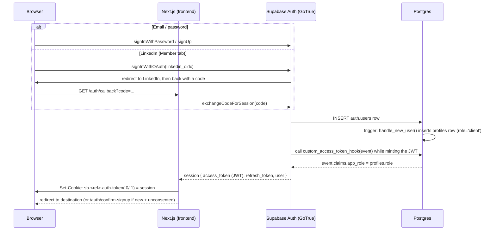
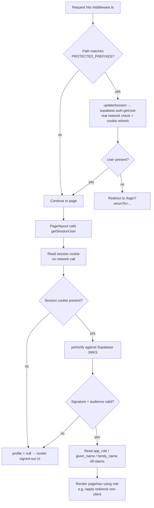
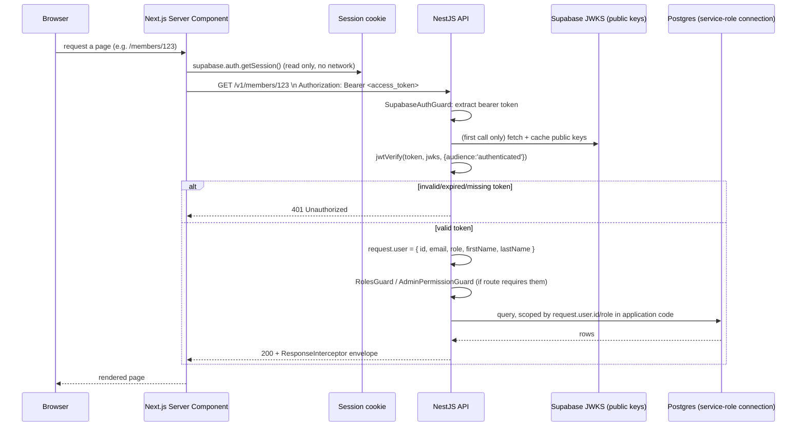
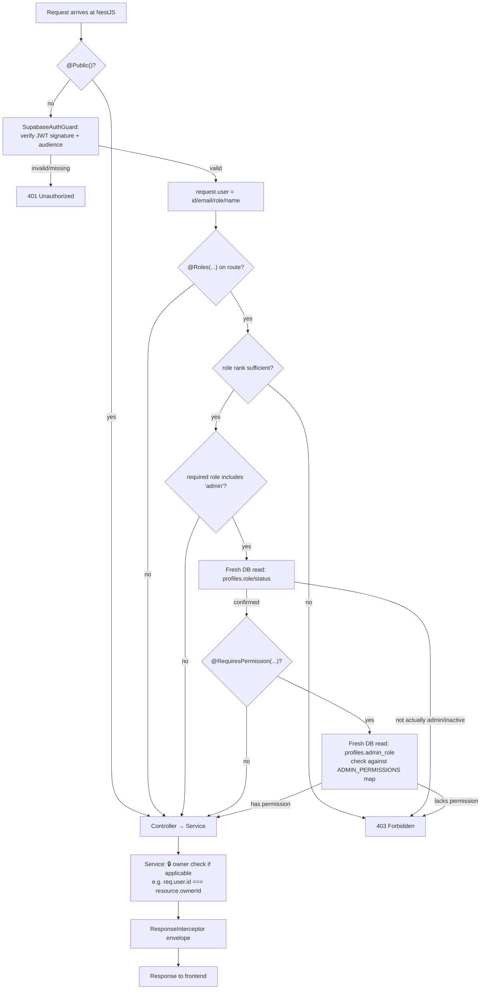

# Expertly — Authentication & Authorization Reference

Full reference for how auth actually works in this repo, kept separate from `CLAUDE.md` so that
file stays scannable as more features ship. Linked from `CLAUDE.md`'s architecture-decisions
section — read that first for the product/role model, this file for implementation detail and
diagrams.

Each major section below opens with a **plain-English summary** (no code, no jargon) before the
technical walkthrough — read just the summaries for the mental model, or the full section for
exact file/line references.

## The model, in one paragraph

**Plain English:** Supabase is the actual "who are you, and are you really logged in" system —
it issues a signed ID card (the JWT) when you log in. Neither this repo's frontend nor its backend
ever re-implements login; they just check that ID card's signature and read a `client`/`member`/
`admin` label off it. The frontend uses that to decide what to show you; the backend uses it to
decide what to let you do.

**Technical:** Supabase/GoTrue owns `auth.users`, credentials, sessions, and OAuth. This repo owns
exactly one extension table, `public.profiles` (role, name, status, admin sub-role). A Postgres
function (`custom_access_token_hook`) injects `profiles.role` into every JWT as a custom
`app_role` claim at token-mint time, so both the frontend (Next.js) and backend (NestJS)
can read the caller's business role straight off the token — locally, via signature verification
against Supabase's public keys (JWKS) — without a network call or DB query on the common path.

## Part 0 — Foundations: what a JWT actually is, and how JWK verification works

Skip this section if you already know JWTs cold. It's here because everything above and below
depends on it, and it's the part most write-ups gloss over.

### What a JWT is

**Plain English:** a JWT is a small, tamper-evident text card. Anyone can read what's written on
it — it's not a secret — but nobody except the issuer (Supabase) can forge or edit one without the
forgery being detectable.

**Technical:** a JWT is three [base64url](https://datatracker.ietf.org/doc/html/rfc4648#section-5)
segments joined by dots: `header.payload.signature`.

- **`header`** — decodes to JSON like `{"alg":"ES256","typ":"JWT","kid":"..."}`. Tells you which
  algorithm signed it and which specific key to check it against.
- **`payload`** — decodes to JSON: the actual claims — `sub` (user id), `email`, `aud`, `exp`,
  `role` (Supabase's built-in Postgres role, always `"authenticated"`), and this project's own
  custom `app_role` claim. **This is base64url encoding, not encryption** — anyone holding the
  token can decode and read the payload with zero effort (that's what jwt.io's decoder does, no
  key required). The signature protects against *tampering*, not against *reading*. Never put
  anything in a JWT payload you wouldn't be fine with the token holder seeing directly.
- **`signature`** — cryptographic proof that `header.payload` was produced by whoever holds the
  matching private key, and hasn't been altered since.

### What JWK / JWKS is, and why verification needs no secret

**Plain English:** think of the private key as a wax-seal stamp only Supabase owns, and the public
key as a widely-published picture of what a genuine impression from that stamp looks like. Making
a new seal impression (signing a token) requires the physical stamp. Checking whether an
impression is genuine (verifying) never does — you only need the reference picture. That asymmetry
is the whole point: this codebase only ever needs to *verify*, so it only ever needs, and only
ever fetches, the public half.

**Technical:** JWK (JSON Web Key) is the standard JSON shape for one public key; JWKS (JWK *Set*)
is a JSON object with a `keys` array of them, published at a predictable URL —
`${SUPABASE_URL}/auth/v1/.well-known/jwks.json`. This project signs with **ES256** (ECDSA over the
P-256 elliptic curve), so each key looks like:
```json
{ "kty": "EC", "crv": "P-256", "kid": "...", "x": "...", "y": "..." }
```
`x`/`y` are coordinates of a point on the curve — that point *is* the public key. Deriving the
private key (a secret number) back out of that point is computationally infeasible; that
one-directional hardness is what makes ECDSA secure. Supabase's private key is never published
anywhere, including that URL — JWKS by definition contains only public keys.

### What signature verification actually checks

Two different things fall out of one math check, `verify(header + payload, signature,
public_key) → true/false`:

1. **Authenticity** — this really was issued by Supabase (only their private key could produce a
   signature this public key validates).
2. **Integrity/tamper-evidence** — if even one character of `header` or `payload` changed after
   signing (e.g. editing `"app_role":"client"` to `"app_role":"admin"` by hand), the signature no
   longer matches, because it's mathematically tied to the *exact* original bytes. This is why
   signature verification always runs **before** any claim (`exp`, `aud`, `app_role`) is trusted or
   even read for a decision — an attacker-edited payload might *look* fine, but the signature check
   fails first and the whole token is thrown out before its content is ever trusted.

### Step by step: what `jwtVerify()` does

Both `apps/frontend/lib/auth/verify-token.ts:50` and `apps/backend/src/auth/verify-token.ts:58`
call the identical function from the `jose` library, `jwtVerify(token, jwks, { audience:
'authenticated' })`. Internally, in order:

1. **Split** the token string on its two dots into `header`, `payload`, `signature`.
2. **Decode the header** (base64url → JSON) to read `alg` (`ES256`) and `kid` (which key).
3. **Resolve the key** — `getJwks()` in both files wraps `jose`'s `createRemoteJWKSet(new
   URL(...jwks.json))`. This isn't a key itself; it's a resolver function `jwtVerify` calls
   internally, which fetches the JWKS once and **caches it in-process** (handles Supabase's key
   rotation automatically), then picks the entry matching the header's `kid`.
4. **Verify the signature** — re-assembles the exact `base64url(header) + "." + base64url(payload)`
   bytes, runs ES256 verification against the `signature` segment using the resolved public key.
   Any mismatch throws immediately — steps 5-6 never run.
5. **Decode the payload** — only now, after the signature is confirmed, base64url-decode it into
   the claims object.
6. **Validate claims** — checks `exp` (not expired) and, because the call passed `{ audience:
   'authenticated' }`, checks `payload.aud === 'authenticated'`. Either failing throws.
7. **Return** `{ payload }` on success. Both `verify-token.ts` files then read `sub`, `email`, and
   the custom `app_role` claim off `payload` to build a `Profile`/`AuthenticatedUser` object;
   `app_role` missing or not one of `client`/`member`/`admin` safely defaults to `'client'` (fails
   closed — see `custom_access_token_hook` in Part 1, step 4, for where that claim comes from).

If *anything* above throws, the calling code (`session-claims.ts:27` on the frontend,
`supabase-auth.guard.ts:44` on the backend) catches it and treats the request exactly like "no
session" / "no token" — there is no partial-trust state.

### Where the token lives, and how each layer actually reads it

**Storage.** The full Supabase session (access token, refresh token, expiry, and your basic user
object) is written to browser cookies by `@supabase/ssr`, via the `cookies` adapter passed to
`createServerClient`/`createBrowserClient` in `apps/frontend/lib/supabase/{client,server,middleware}.ts`.
Cookie name pattern: `sb-<project-ref>-auth-token` — and because the whole session object
(including a LinkedIn `provider_token` for OAuth users, `refresh_token`, etc.) often exceeds a
single cookie's ~4KB limit, `@supabase/ssr` transparently splits it into `sb-<project-ref>-auth-token.0`,
`.1`, etc. Reassembling and base64-decoding those chunks yields JSON shaped like
`{"access_token":"eyJ...","refresh_token":"...","user":{...}}` — the `access_token` value there
*is* the JWT described above. (This project deliberately uses cookies, not `localStorage` — plain
`supabase-js`'s default — specifically so server-side code, which can't touch browser storage, can
read the session too.)

**Retrieval — two different tiers, used for different purposes:**
- **Cheap, unverified read**: `supabase.auth.getSession()` (used in `session-claims.ts:22` and
  every `lib/api/server.ts` function that needs a token to forward) just reads and decodes what's
  in the cookie — no signature check, no network call. This is fine when the only thing you need is
  *the raw token string itself* to hand to someone else who will verify it (the backend), but it is
  **not** sufficient on its own to trust the claims inside for an authorization decision — see
  `middleware.ts`'s deliberate use of `getUser()` instead, next.
- **Network-verified read**: `supabase.auth.getUser()` (used only in `lib/supabase/middleware.ts`)
  actually asks Supabase's server to confirm the session is still valid — a real network call, used
  specifically where middleware needs a guaranteed-current answer and also needs to refresh a
  soon-to-expire cookie.
- **Local-signature-verified read**: `verifySupabaseToken()` (both `verify-token.ts` files) is the
  in-between option this project relies on for every authorization decision: no network call (fast,
  like `getSession()`), but cryptographically trustworthy (unlike `getSession()`), via the
  `jwtVerify()` process above.

**Sending it to the backend.** `apps/frontend/lib/api/server.ts` (e.g. `getMemberServer:64-83`,
`getArticleServer:148-167`) calls `getSession()` to grab `session.access_token`, then attaches it
verbatim as `headers: { Authorization: \`Bearer ${session.access_token}\` }` on the `fetch()` call
to the NestJS API. Public endpoints (`getMembersServer`, `getEventsServer`,
`getPracticeAreasServer`) send no header at all, matching the backend's `@Public()` routes.

**Backend validation.** `SupabaseAuthGuard.canActivate()` (`apps/backend/src/auth/guards/supabase-auth.guard.ts:29-49`)
does `extractBearerToken(request.headers.authorization)` (`:52-57`, just a `split(' ')` on the
header, checking the scheme is `Bearer`) and passes the extracted string straight into the
backend's own `verifySupabaseToken()` — the exact same `jwtVerify()` process described above,
running against the backend's own independently-cached JWKS fetch (a separate process from the
frontend, so a separate in-memory cache). Success attaches `request.user`; failure throws
`UnauthorizedException` before any controller code runs.

## How authentication & authorization actually flow

Two separate, independent checks exist — **neither trusts the other; both verify the same JWT
themselves**:

1. **Page-level gating (Next.js only, no backend call).** Deciding whether a page renders at all —
   guest vs. signed-in, and role-specific redirects — happens entirely in
   `apps/frontend/middleware.ts` and each page's Server Component, by verifying the session JWT
   locally (`getSessionUser()`). The backend is never called just to load a page.
2. **API-level authorization (frontend → backend, per data call).** When a page needs data from
   the NestJS API, the frontend attaches the Supabase access token as `Authorization: Bearer
   <token>`. The backend independently re-verifies that same token (`SupabaseAuthGuard`) and
   authorizes the specific endpoint by role (`RolesGuard`, `AdminPermissionGuard`) — it does not
   trust that the frontend already checked anything.

**Where the token lives, how it's read, and how it reaches the backend** is covered in full in
Part 0 above ("Where the token lives, and how each layer actually reads it") — short version:
cookies via `@supabase/ssr` (not `localStorage`, so server-side code can read it too), sent to the
backend as `Authorization: Bearer <token>`.

---

## Part 1 — Frontend: signing in and establishing a session

**Plain English:** When you log in (or sign up), your browser talks directly to Supabase — not to
this repo's own backend — and Supabase hands back a signed session, which gets stored as cookies
in your browser. From then on, every page you visit reads that cookie to know who you are, without
asking anyone else.

### Step by step

1. **`/login`** (`apps/frontend/app/login/page.tsx`, `components/auth/AuthCard.tsx`) — one combined
   page with User/Member tabs, matching the design mockup.
   - **User tab**: first/last name + email + password, single "Continue" button that
     auto-detects login-vs-signup (tries sign-in, falls back to sign-up only on
     `invalid_credentials` — see `lib/auth/continue-with-email.ts`).
   - **Member tab**: LinkedIn OAuth only, no password field (members have no password —
     provisioning happens via the membership-application approval flow, not self-signup).
2. **Supabase issues a session.** Whether via email/password (`supabase.auth.signInWithPassword`/
   `signUp`) or LinkedIn OAuth (PKCE code exchange in `app/auth/callback/route.ts`), Supabase's own
   servers do the actual authentication. This repo's code never sees a password or handles
   credentials itself.
3. **A Postgres trigger provisions your profile row.** The moment `auth.users` gets a new row,
   `handle_new_user()` (`supabase/migrations/0003_functions.sql`) fires and inserts a matching
   `public.profiles` row — always starting as `role = 'client'`, `status = 'active'` — reading
   name fields from whichever signup path populated them (`first_name`/`last_name` for email
   signup, the OIDC standard `given_name`/`family_name` for LinkedIn).
4. **The Custom Access Token Hook stamps your role onto the JWT.** Every time Supabase mints or
   refreshes a token for you, `custom_access_token_hook` (same file) runs *inside Postgres* and
   copies `profiles.role` into the token as a custom `app_role` claim. This is what lets the
   frontend/backend read your role without a DB query later — see "Known issue we hit" below for a
   real bug in this exact step.
5. **`@supabase/ssr` writes the session into cookies**, via `apps/frontend/lib/supabase/{client,server,middleware}.ts`.
6. **Consent handling for OAuth** (`app/auth/callback/route.ts`'s `isNewlyCreatedAccount()`): since
   Supabase creates the account as an unavoidable side effect of the LinkedIn handshake, there's no
   "before" moment to show a consent checkbox for OAuth. If the account was just created and
   consent wasn't already collected upfront, the user is routed to `/auth/confirm-signup` instead
   of their real destination — a confirmation screen that signs them back out on Cancel rather than
   leaving an unconsented session active.

### Sequence diagram — establishing a session



---

## Part 2 — Frontend: deciding what a page shows (no backend involved)

**Plain English:** Every time you load a page, the Next.js server peeks at your session cookie,
checks it's genuine, and reads your name/role off it — all locally, without asking Supabase or
this repo's backend anything over the network. That's how the sidebar knows your name and which
nav links to show, and how `/apply` or `/login` redirect you before the page even renders.

### Step by step

1. **`middleware.ts`** runs on almost every request (see its `matcher`). It calls `updateSession()`
   (`lib/supabase/middleware.ts`), which uses `getUser()` — **not** `getSession()` — because this
   step genuinely needs a real, network-verified check (it also refreshes the session cookie if the
   access token is close to expiry). If the path starts with a protected prefix
   (`PROTECTED_PREFIXES = ['/dashboard', '/apply']` — note `/dashboard` no longer has a real page
   behind it; only `/apply` is live today, see "left for future") and there's no user, it redirects
   to `/login`.
2. **The page's Server Component calls `getSessionUser()`** (`lib/auth/session-claims.ts`) — the
   fast path used by nav rendering, `/login`'s already-signed-in redirect, and role-based redirects
   like `/apply`'s "members/admins don't belong here." This:
   - Reads the session cookie (`supabase.auth.getSession()` — no network call, just decodes what's
     stored).
   - Verifies the JWT's signature via `verifySupabaseToken()` (`lib/auth/verify-token.ts`) against
     Supabase's JWKS (`jose`'s `createRemoteJWKSet`, public keys cached in-process).
   - Reads `role` off the `app_role` claim (defaulting to `'client'` if missing/unrecognized —
     fails closed) and name off `user_metadata.given_name`/`family_name`.
   - Wrapped in React's `cache()` so multiple call sites in one request (e.g. the shell layout's nav
     *and* the page itself) dedupe to a single verification.
3. **`AppShell`/`Sidebar`/`MobileDrawer`** (`components/layout/`) receive the resulting `Profile |
   null` and render accordingly — initials + name in the footer, "Apply Now" only for `client`s,
   sign-in link when logged out.
4. **The one DB-fresh alternative**: `lib/auth/profile.ts`'s `getCurrentProfile()` bypasses the JWT
   claim entirely and queries `profiles` directly. Nothing uses this yet — it's reserved for a
   future page that needs guaranteed-current data (e.g. immediately before a sensitive action),
   mirroring the backend's admin fresh-check pattern below.

### Flowchart — page render / route gating



---

## Part 3 — Frontend → Backend: an authenticated API call

**Plain English:** When a page actually needs data from this repo's own backend (not just
Supabase), the frontend grabs your session's access token and hands it to the backend as proof of
who's asking. The backend never assumes the frontend already checked anything — it re-verifies
that same token itself, every time.

### Step by step

1. A Server Component calls a function in `lib/api/server.ts` (e.g. `getMemberServer`,
   `getArticleServer`, `getMyApplicationServer`) or a Client Component calls through `apiClient`.
2. That function reads the session (`supabase.auth.getSession()`) to grab `session.access_token`,
   and sends it as `Authorization: Bearer <token>` to the NestJS API — `fetch(...,{ headers: {
   Authorization: \`Bearer ${session.access_token}\` } })`.
3. **Public endpoints** (e.g. `getMembersServer`, `getPracticeAreasServer`, `getEventsServer`) skip
   this — no session, no header, matching the backend's `@Public()` routes.
4. The backend's guard chain (Part 4) verifies the token independently and resolves `request.user`.

### Sequence diagram — one authenticated API call, end to end



---

## Part 4 — Backend authorization: the guard chain

**Plain English:** Every request into the backend has to pass through up to three checkpoints, in
a fixed order, before it reaches your actual endpoint code: "are you who you say you are," "does
your role allow this route at all," and — only for admin-only actions — "let's double-check that
against the database right now, since roles can go stale." Each checkpoint can reject the request
outright; none of them trust the ones before it blindly, and none of them re-verify what the
previous one already confirmed.

### Step by step

`apps/backend/src/auth/` implements the server-side half of `rest-api.md`'s access-level model
(🌐 Public / 🔑 Auth / 👤 Member / 🛡️ Admin / 🔒 Owner). All three guards below are registered
**globally** via `APP_GUARD` in `auth.module.ts`, in this order (order matters — each depends on
the one before it having already run):

1. **`SupabaseAuthGuard`** (`guards/supabase-auth.guard.ts`) — runs on every route unless
   `@Public()`. Verifies the token's signature against the project's JWKS (`verify-token.ts`, same
   `jose`/`createRemoteJWKSet` approach as the frontend — no network call to Supabase Auth, no DB
   query), reads `role` off `app_role` (defaults to `'client'`, fails closed) and name off
   `user_metadata`, attaches the result as `request.user`. Missing/invalid token → `401` and
   nothing downstream runs.
2. **`RolesGuard`** (`guards/roles.guard.ts`) — only acts on routes carrying `@Roles('member' |
   'admin')` metadata. Roles are ranked (`types/auth.types.ts`'s `ROLE_RANK`), so `@Roles('member')`
   also admits `admin` — **`@Roles()` always means "this role or higher," never "exactly this
   role."** For an endpoint that must reject even higher-ranked roles (e.g. `POST /v1/applications`
   — a `member`/`admin` re-applying makes no sense and must be `403`), don't reach for `@Roles()`;
   do an explicit `user.role !== 'x'` check in the service instead (see
   `applications.service.ts`'s `create()`).
   - **The one real DB round-trip in this whole chain**: when the required role is specifically
     `'admin'`, `RolesGuard` doesn't trust the token's claim — it re-queries
     `profiles.role`/`status` fresh, via the service-role client, before granting access. This
     trades staleness (a role change takes up to ~1hr to reflect in the token) for zero per-request
     I/O everywhere else; that tradeoff is only unsafe for admin, so only admin pays the DB cost.
     A stale-but-under-privileged token is denied outright, never fresh-checked — false denials are
     safe, false grants are not.
3. **`AdminPermissionGuard`** (`guards/admin-permission.guard.ts`) — opt-in via
   `@RequiresPermission('manageMembers')`, always paired with `@Roles('admin')` on the same route
   (this guard doesn't itself check the base role). Narrows further: fresh-reads
   `profiles.admin_role` (`super_admin` / `content_manager` / `reviewer`,
   `constants/admin-permissions.ts`) and checks it against a static permission map. Same
   fail-closed posture as step 2. An admin with `admin_role = null` (every admin created before
   this system existed) is treated as `super_admin`.
4. **`@Public()`, `@Roles(...)`, `@RequiresPermission(...)`, `@CurrentUser()`** decorators in
   `auth/decorators/` — used on every controller; no route manually re-checks bearer tokens.
5. **🔒 Owner scoping** (e.g. "can only edit your own article") has **no generic guard** — it's a
   per-endpoint comparison of `req.user.id` against the resource's owner id, in the service layer,
   using `@CurrentUser()`. This is intentional, not a gap: see "RLS vs. the service role" below for
   why this lives in application code instead of a database policy.
6. **`ResponseInterceptor`** wraps the final response in the standard envelope before it reaches
   the frontend.

### Flowchart — the guard chain



---

## RLS vs. the service role — why row-level checks live in application code

**Plain English:** This repo's backend connects to the database using one shared, all-access key
(not "as you, the specific logged-in user"), so a database-level rule like "you can only edit your
own article" would never actually get checked by Postgres for requests coming through this API —
Postgres has no idea which end user is asking. That's why those checks are written as ordinary
TypeScript in the backend instead.

**Technical:** The backend's Supabase client uses the **service-role key**, which bypasses RLS
entirely by Supabase's own design. RLS policies (like `profiles_select_own`, gated on `auth.uid()
= id`) only mean something when the querying connection carries an end-user JWT — the service-role
connection never does, so those policies never fire for traffic through this API. RLS here is
**defense-in-depth against a leaked anon key hitting Supabase directly**, not the primary
enforcement mechanism — that's the API's guards + service-layer checks. This is a deliberate,
already-locked-in architecture decision (see root `CLAUDE.md`), not an oversight: with rank-based
roles, fine-grained admin permissions, and array/JSONB foreign-key validation, expressing every
rule as a SQL policy would mean maintaining the same authorization logic twice, in two languages,
with a real risk of the two drifting apart. **If a future client (e.g. a mobile app) is meant to
talk to Supabase/Postgres directly instead of through this NestJS API**, RLS would need to become
a genuine, complete, primary enforcement layer for that path specifically — that's a deliberate,
scoped decision to make when that project actually starts, not something to build speculatively
now.

---

## Known issue we hit (and fixed) — LinkedIn login 500

**What happened:** LinkedIn OAuth login failed with a `500` on `POST /auth/v1/token`, after the
LinkedIn handshake itself (`/authorize` → `/callback`) succeeded fine.

**Root cause:** `custom_access_token_hook` (`supabase/migrations/0003_functions.sql`) is not
`security definer`, so when Supabase's Auth server calls it during token minting, its `select role
from public.profiles ...` runs as the `supabase_auth_admin` role. That role had never been granted
`SELECT` on `profiles`, and even if it had, `profiles`' only RLS policy
(`profiles_select_own`, gated on `auth.uid() = id`) wouldn't have admitted it anyway — there's no
end-user JWT context during this internal call. Confirmed directly from Postgres logs:
`sql_state_code: "42501"` (`insufficient_privilege`), `user_name: "supabase_auth_admin"`, thrown
from inside `custom_access_token_hook`. When this hook throws, Supabase fails the *entire*
token-issuance call — so **every login provider was actually at risk**, not just LinkedIn; it
simply hadn't been exercised for email/password logins in a way that hit this path the same way.

**Fix** (`supabase/migrations/0004_tables.sql`, right after `profiles_select_own`):
```sql
grant select on table public.profiles to supabase_auth_admin;

create policy profiles_select_auth_admin
  on public.profiles for select
  to supabase_auth_admin
  using (true);
```
This grants `supabase_auth_admin` read access to `profiles` for exactly this purpose, without
weakening `profiles_select_own` for real end users. Applied to the live dev database via the
Supabase SQL Editor / direct Postgres connection — remember this repo's migrations are **applied
manually** (see `supabase/migrations/README.md`), so a schema-file edit alone never fixes a live
environment by itself.

**Takeaway for future Postgres functions that read app tables on behalf of Supabase's internal
roles** (`supabase_auth_admin`, and similarly `supabase_storage_admin` for Storage hooks): either
mark the function `security definer` (it then runs as its owner, typically a superuser-ish role),
or explicitly grant the calling role table access **and** add a matching RLS policy — RLS being
enabled by default on every table in this repo means the grant alone is not sufficient.

---

## Left for the future

- **Role-restricted frontend pages beyond `/apply`.** No generic `requireRole()` helper exists yet
  — `/apply`'s redirect (`profile.role !== 'client'`) is the only example so far. Extract a
  helper once a second page needs the same pattern; not built speculatively ahead of that.
- **`/dashboard` is stale in `middleware.ts`'s `PROTECTED_PREFIXES`** — the page itself no longer
  exists (replaced by the `(shell)` route group: home, articles, members, events). Either remove
  the dead prefix entry or repurpose it when a real dashboard page is built.
- **Generic 🔒 Owner guard doesn't exist.** Each endpoint currently does its own `req.user.id ===
  resource.ownerId` check in the service layer. Fine at the current scale; revisit if this
  duplication becomes a real pattern across many endpoints.
- **Admin fresh-DB-check pattern should extend to individual destructive Member endpoints** as
  they're built (per root `CLAUDE.md`) — today it's scoped to `@Roles('admin')` and
  `@RequiresPermission(...)` only.
- **RLS-as-primary-enforcement is an explicitly deferred decision**, not a gap — see "RLS vs. the
  service role" above. Revisit only if a client that bypasses this NestJS API (e.g. a mobile app
  talking to Supabase directly) actually gets built.
- **No monitoring/alerting on Auth-hook failures.** The LinkedIn bug above was only caught by
  manually reading Postgres logs after a user-reported failure. There's no automated check today
  that would catch a similar `custom_access_token_hook` permission regression before a real user
  hits it.
- **`getCurrentProfile()` (frontend) and the backend's admin fresh-check are the only DB-fresh
  reads that exist** — no page currently calls `getCurrentProfile()`; it's reserved for a future
  sensitive/destructive frontend action that can't tolerate claim staleness.

## Environment / setup reference

- Backend needs `SUPABASE_URL` / `SUPABASE_SERVICE_ROLE_KEY` / `DATABASE_URL` in
  `apps/backend/.env` — the service-role key and direct DB URL are backend-only, **never** exposed
  to the frontend. No separate JWT secret needed; verification uses the project's public JWKS,
  derived from `SUPABASE_URL` alone. The app fails fast on boot if `SUPABASE_URL`/
  `SUPABASE_SERVICE_ROLE_KEY` are missing (`SupabaseService`'s constructor).
- Frontend needs `NEXT_PUBLIC_SUPABASE_URL` / `NEXT_PUBLIC_SUPABASE_ANON_KEY` in
  `apps/frontend/.env` — anon key only, never the service-role key.
- **Manual Supabase-dashboard steps** (not scriptable, easy to forget on a fresh project): enable
  the LinkedIn (OIDC) provider under Authentication → Providers; add `/auth/callback` to
  Authentication → URL Configuration → Redirect Values for every environment; register
  `custom_access_token_hook` under Authentication → Hooks → "Customize Access Token (JWT) Claims."
  (Confirmed already done on the current dev project — see the postmortem above; the hook was
  firing, just failing partway through.)
- Schema lives in `supabase/migrations/0001_extensions.sql` → `0004_tables.sql` (pre-production,
  four-file convention — see that folder's `README.md`), applied manually via the Supabase SQL
  Editor, not automatically on deploy.
